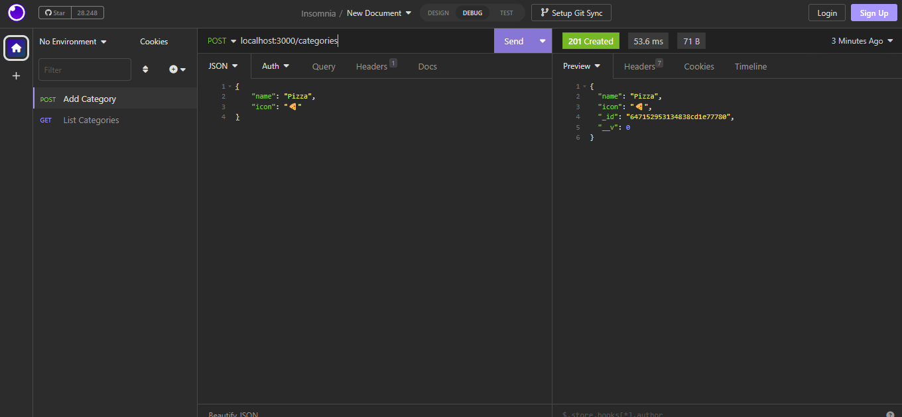
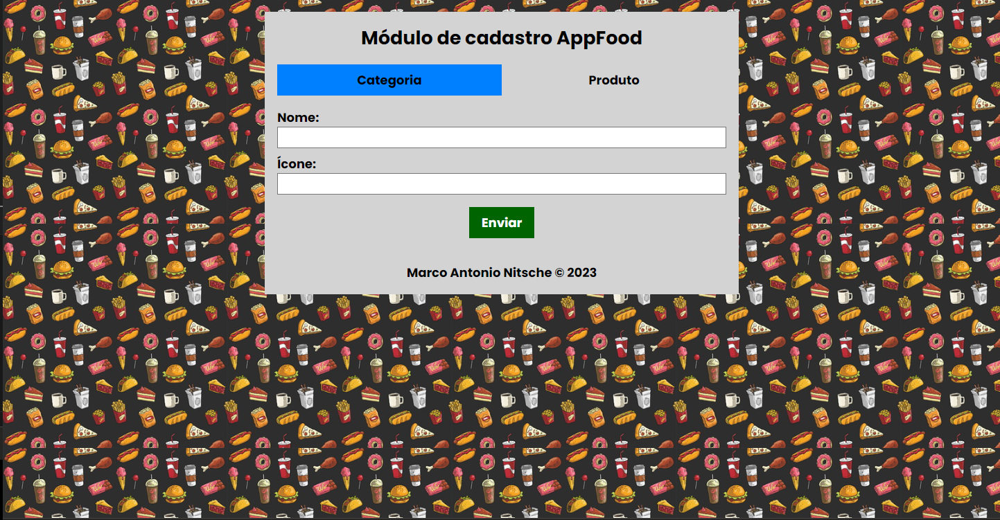
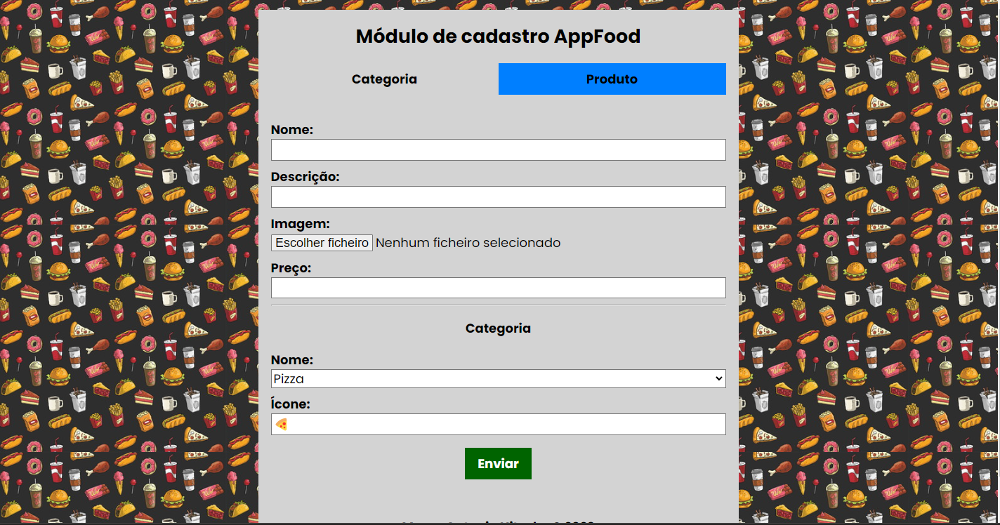
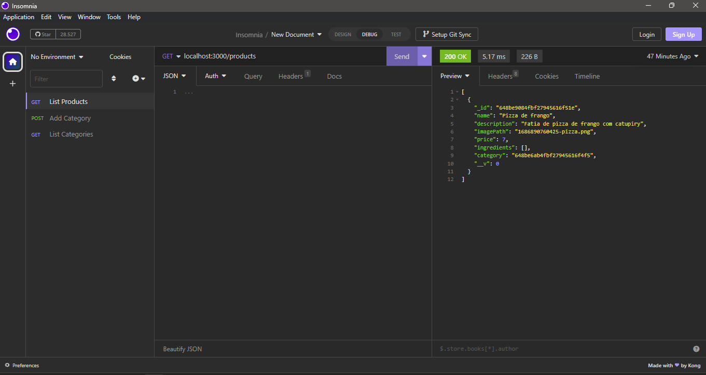

# README.md - AppFood
Os passos a seguir são validos, e fazem com que o docker e o aplicativo AppFood com requisições GET e POST, que estamos desenvolvendo, funcionem no ambiente Windows

## 1 - Ao instalar o Docker:
Quando o docker for instalado e executado no windows pela primeira vez, o próprio sistema irá solicitar para que o usuário abra o prompt de comando e execute o seguinte comando:

~~~
wsl --update
~~~

 Este comando garante que o WSL, que é uma dependência para que o docker rode no windows, esteja atualizado e funcionando corretamente.

---------------------------------------------------------------------------------------------------------------

## 2 - Com o Docker instalado:
Executar a seguinte sequência de comandos, no terminal do proprio vscode:

**1**

~~~
npm install
~~~

Esse comando é usado para instalar as dependências do projeto Node.js a partir do arquivo package.json. Ele lê as informações de dependência definidas no arquivo e baixa e instala todas as dependências necessárias na pasta node_modules.

**2**

~~~
npm install -g yarn
~~~

Esse comando é usado para instalar o Yarn globalmente no sistema. O Yarn é um gerenciador de pacotes alternativo ao npm.

**3**

~~~
docker run --name mongodb -d -p 27017:27017 mongo
~~~

Esse comando é usado para executar um contêiner Docker com uma instância do MongoDB. Ele cria e inicia um contêiner chamado "mongodb". Uma observação relevante, é que, caso já exista um contêiner com o nome informado no comando, ele deve ser excluído pelo docker desktop.

**4**

~~~
yarn dev
~~~

Esse comando é usado para iniciar o servidor de desenvolvimento do projeto.

**Passo extra:**
Esse passo deve ser realizado caso o comando yarn dev apresente o seguinte erro ao ser executado pela primeira vez no terminal do vscode:

~~~
yarn : O arquivo C:\Users\marco\AppData\Roaming\npm\yarn.ps1 não pode ser carregado porque a execução de scripts foi
desabilitada neste sistema. Para obter mais informações, consulte about_Execution_Policies em
https://go.microsoft.com/fwlink/?LinkID=135170.
No linha:1 caractere:1
+ yarn dev
+ ~~~~
    + CategoryInfo          : ErrodeSegurança: (:) [], PSSecurityException
    + FullyQualifiedErrorId : UnauthorizedAccess
~~~

Para resolver este problema, será necessário abrir o windows powershell / terminal do vscode em modo administrador, e primeiramente, verificar as permissões de acesso do yarn, com o seguinte comando:

~~~
Get-ExecutionPolicy
~~~

Por padrão, ele está sempre marcado como Restricted, e devemos alterá-lo para Unrestricted, com o seguinte comando:

~~~
Set-ExecutionPolicy Unrestricted
~~~

Após essa alteração, com a execução dos dois comandos extras citados, o yarn funcionará, sem nenhum erro. 

---------------------------------------------------------------------------------------------------------------

## 3 - Insomnia:
Tendo executado os passos e comandos anteriores, resta fazer as requisições GET e POST, e para isso, usaremos o Insomnia. Então devemos abrir o programa após instalá-lo, e podemos já criar duas requisições, clicando no botão "+", e em "HTTP Request".

Devemos renomeá-las para List Categories e Add Category, respectivamente.

Por padrão, as duas requisições serão criadas com o tipo GET, porém na Add Category, devemos mudar seu tipo para POST, clicando no tipo da requisição, (que até então é GET e estará escrito em azul), e selecionar o POST (e assim a requisição mudará para o tipo POST, escrito em verde).

Feitos esses ajustes, devemos adicionar ítens na requisição POST, Add Category. Até agora, no arquivo Category.ts, podemos observar que foram desenvolvidos apenas dois parâmetros, name e icon. Sabendo disso, na requisição POST no insomnia, podemos selecionar a aba Body, e no submódulo TEXT, selecionar a opção JSON. Dessa forma podemos escrever os parâmetros e seu conteúdo na parte "digitável" da página que será liberada. Podemos escrever conforme abaixo, onde usei o exemplo de um ícone de pizza.

~~~
{
    "name": "Pizza",
    "icon": "🍕"
}
~~~

Tanto no Add Category quanto no List Categories, devemos alterar o endereço das requisições (ao lado do tipo escrito em colorido) para o seguinte:

~~~
localhost:3000/categories
~~~

Após isso, podemos clicar no botão Send na requisição Add Category, para adicionar o exemplo de pizza como uma categoria, e depois, clicar no botão Send na requisição List Category para listar todas as categorias já criadas.

**Imagens de como as requisições devem ficar, e como estão funcionando:**

---------------------------------------------------------------------------------------------------------------

## 4 - Formulários para cadastro (frontend):

Foram desenvolvidos dois formulários para cadastro de informações referentes a categorias e produtos respectivamente, de forma que esses dados são salvos diretamente no banco de dados MongoDB. Os arquivos HTML, CSS e JavaScript referentes a essas telas estão na pasta [front](front/).

* **Cadastro de categorias:** Para cadastrar uma nova categoria, basta digitar o nome e o ícone respectivamente, e clicar no botão enviar. Conforme forem sendo realizados novos cadastros, um alerta deverá ser exibido na página, informando que uma nova categoria foi cadastrada. Segue uma foto do frontend do formulário de cadastro de categorias:

* **Cadastro de produtos:** Para cadastrar um novo produto, deve-se digitar o nome, a descrição, selecionar uma imagem, além de selecionar uma categoria que já esteja cadastrada. Quando o nome da categoria for selecionado na aba de cadastro de produtos, o seu respectivo ícone será exibido no campo de mesmo nome, porém o usuário não poderá alterar o que aparece nesse campo. Segue uma foto do frontend do formulário de cadastro de produtos:

O cadastro de produtos está funcionando, porém, deve-se enviar os dados mais de uma vez. Segue um print do retorno da requisição GET feita no endereço localhost:3000/products funcionando, após o cadastro pelo frontend de cadastro de produtos:

